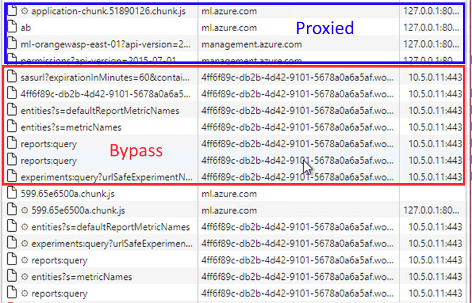

# azure-ml-private-networking-tools

## Summary

This repository contains additional notes, checklists, and (eventually) tools to help configure and validate fully private Azure ML deployments.

## Notes

- Due to the fact that Azure ML will create and manage compute instances on the user's behalf, I highly recommend **not using HOSTS files** during any part of the evaluation and implementation of Azure ML Private Networking.  Since the creation of compute instances and compute clusters require the ability to resolve private link addresses, local HOSTS files can not be leveraged beyond the initial portal configuration.

## How to create a secure workspace

Microsoft Docs contains a tutorial to walk through creating a secure workspace, along with the requisite Azure resources, connectivity, and configuration.  With the number of steps, there is the potential for missed or incomplete steps.  During the initial configuration, as well as during any troubleshooting, it can be helpful to have a checklist to work through to ensure that nothing was missed or misconfigured.
- [Configuration Checklist](configuration_checklist.md) - this is an empty markdown file that can be used in conjunction with the official documentation to validate each component is properly deployed and configured.
- [Configuration Checklist Example](configuration_checklist_example.md) - this is a completed example markdown file to serve as a representative example.

## Common Issues

The following are common issues I've seen in deploying Azure ML privately.  
1. *Provisioning a compute instance fails with the message "The specified Azure ML Compute Instance testsid2 setup failed with error "Failed to get workspace secrets. Details - Root cause: ". Please delete and try to recreate. If the problem persists, please follow up with Azure Support."* - More than likely, there's an issue with private link (specifically the keyvault URIs) being unable to resolve from the ML Vnet.  Validate the configuration with the checklist to see why the vault.azure.net isn't resolving privately.
2.  *When loading the portal, an error is displayed that "Your administrator has disabled connectivity to your workspace instance from the public internet..."* - If you have a proxy between your browser and the ML portal, it's possible that the proxy is causing the traffic to the private link ML workspace is being routed externally.  Make sure that there are proxy bypasses in place for `*notebooks.azure.net;*api.azureml.ms;*notebooks.azure.net;*instances.azureml.ms;*aznbcontent.net;*files.core.windows.net`.

3.  *When attempting to 'bring my own data' and using Azure Data Lake Storage Gen 2 (or likely other data sources), I'm unable to access them from the portal over the private link connection.* - The Managed Identity for the ML Workspace needs to be granted reader access to the service's private endpoints.  This is documented [here](https://docs.microsoft.com/en-us/azure/machine-learning/tutorial-create-secure-workspace#:~:text=When%20using%20an%20Azure%20Storage%20Account%20that%20has%20a%20private%20endpoint%2C%20add%20the%20service%20principal%20for%20the%20workspace%20as%20a%20Reader%20for%20the%20storage%20private%20endpoint(s).%20From%20the%20Azure%20portal%2C%20select%20your%20storage%20account%20and%20then%20select%20Networking.%20Next%2C%20select%20Private%20endpoint%20connections.) for the initial setup, but is also required for adding data sources to the environment later.  Additionally, for ADLS Gen 2, both the DFS and the Blob private endpoints need to be created. 